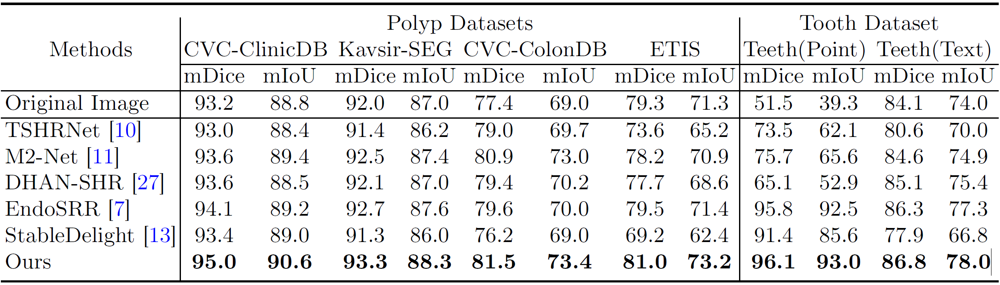

<div align ="center">
<h1>Endoscopic Artifact Inpainting for Improved Endoscopic Image Segmentation (MICCAI 2025 SpotLight)</h1>

[Zhangyuan Yu](https://github.com/Raven-July)<sup>\*1</sup>, [Chenlin Du](https://scholar.google.com/citations?user=aEvQIioAAAAJ&hl=zh-CN)<sup>\*2</sup>, Hongrui Liang<sup>1</sup>, Xiuqi Zheng<sup>1</sup>, Zeyao Ma<sup>3</sup>, Mingjun Wu<sup>4</sup>, Mingwu Ao<sup>4</sup>, [Qicheng Lao](qicheng.lao@bupt.edu.cn)<sup>1,📧</sup>  

<sup>1</sup> School of Artificial Intelligence, Beijing University of Posts and Telecommunications (BUPT), Beijing, China  
<sup>2</sup> Department of Geriatric Dentistry, Peking University School and Hospital of Stomatology & National Center of Stomatology & National Clinical Research Center for Oral Diseases & Research Center of Engineering and Technology for Computerized Dentistry Ministry of Health & NMPA Key Laboratory for Dental Materials, Beijing, China  
<sup>3</sup> Department of Orthodontics, School of Stomatology, Capital Medical University, Beijing, China  
<sup>4</sup> Ningbo Fregty Optoelectronics Technology Co., Ltd, Ningbo, China  

(\* equal contribution, 📧 corresponding author)

[](https://papers.miccai.org/miccai-2025/paper/1575_paper.pdf)
[](https://drive.google.com/file/d/1um3VlzU1f5ynaiTFrAxtpIl5LgFfKrz2/view?usp=sharing)  
</div>

---

## 1. Overview

### 1.1 Abstract

Endoscopic imaging plays a crucial role in modern diagnostics and minimally invasive procedures. However, Artifacts caused by specular and diffuse reflections present significant challenges to downstream tasks such as segmentation.

Inspired by the simplified Phong model for endoscopy, we propose a two-stage artifact inpainting framework. The first stage suppresses specular artifacts, while the second stage focuses on inpainting diffuse artifacts. Additionally, we introduce a weight map to control the handling of diffuse artifacts, ensuring a more precise enhancement.

The **two-stage artifact inpainting framework** is composed of:

1. **Suppresses Specular Artifact** via a DUCKNet(Trained from scratch) + LaMa pipeline.
2. **Refines Diffuse Artifact** using StableDelight with an adaptive weight-map guided fusion.

Extensive experiments on colonoscopy and dental endoscopy datasets show that our method significantly improves segmentation accuracy (mDice ↑ from 51.5% to 96.1% for zero-shot when SAM segmentation using point prompt).

<p align="center">
<br>
<em>Figure 1: Overview of our two-stage endoscopic artifact inpainting framework.</em>
</p>

---

## 2. Installation

### 2.1 Python Environment

This repository is developed with **Python 3.10.16**.
Create a virtual environment and install dependencies:

```bash
# clone repository
git clone git@github.com:Raven-July/Endoscopic-Artifact-Inpainting.git
cd Endoscopic-Artifact-Inpainting
# create conda environment
conda create -n Artifact python==3.10
conda activate Artifact
# install dependencies
pip install uv
uv pip install -r requirements.txt
```

⚠️ *Note:* We have not yet tested on other Python versions or operating systems.

### 2.2 Models

1. **DUCKNet Model**
   * Download from [GoogleDrive](https://drive.google.com/file/d/1um3VlzU1f5ynaiTFrAxtpIl5LgFfKrz2/view?usp=sharing)
   * Place `Duck16mod_Spec_99_new.pt` into `./weights` folder.

2. **Pretrained Big-LaMa Model**
   * Download from [GoogleDrive](https://drive.google.com/drive/folders/1B2x7eQDgecTL0oh3LSIBDGj0fTxs6Ips?usp=sharing)
   * Unzip and place the `big-lama` **folder** into `./weights` folder. 

3. **Pretrained StableDelight Model**

   * Download from [HuggingFace](https://huggingface.co/Stable-X/yoso-delight-v0-4-base/tree/main)
   * Place the `yoso-delight-v0-4-base` **folder** into `./weights` folder.

---

## 3. Usage

### 3.1 Run the Inpainting Pipeline

Simply execute:

```bash
sh process.sh
```

This will run the full two-stage artifact inpainting pipeline. Results will appear in `./outputs` folder.

### 3.2 Key Parameters

| Parameter          | Description                                                                                                                                                               | Default |
| ------------------ | ------------------------------------------------------------------------------------------------------------------------------------------------------------------------- | ------- |
| `lama_dilate_size` | Controls the dilation kernel size applied to the DUCKNet specular mask before passing to Big-LaMa. Larger values remove more highlights but risk over-inpainting.         | 15      |
| `mix_thresh`       | Threshold for fusing DUCKNet+LaMa result with StableDelight output. Pixels above this brightness are considered diffuse highlights and blended with StableDelight output. | 150     |

You can modify these parameters in `process.sh` before running the pipeline.

---

## 4. Training and Evaluation
### Dataset Preparation
Links to public datasets:
* [CVC-ClinicDB](https://www.dropbox.com/s/p5qe9eotetjnbmq/CVC-ClinicDB.rar?dl=0)
* [Kvasir-SEG](https://datasets.simula.no/kvasir-seg/)

* [CVC-ColonDB](https://www.kaggle.com/datasets/longvil/cvc-colondb) 

* [ETIS-LaribPolypDB](https://www.kaggle.com/datasets/mahmudulhasantasin/etis-laribpolypdb)

* [CVC-ClinicSpecific](https://github.com/hmzawz2cbh/CVC-ClinicSpecific-restore?)

### Training
Coming soon...

### Evaluation
Coming soon...

---

## 5. Results

### 5.1 Quantitative Results

Our method achieves better artifact inpainting quality and robustly improve the segmentation performance of endoscopic images.

<p align="center">
<br>
<em>Figure 2: Quantitative comparison for segmentation performance enhancement.</em>
</p>

<p align="center">
<br>
<em>Figure 3: Visual comparison of artifact inpainting results.</em>
</p>

<p align="center">
<br>
<em>Figure 4: Segmentation result comparisons between our method and baselines.</em>
</p>

---

## 6. Citation

If you find this repository useful, please cite our paper:

```bibtex
@InProceedings{YuZha_Endoscopic_MICCAI2025,
        author = { Yu, Zhangyuan AND Du, Chenlin AND Liang, Hongrui AND Zheng, Xiuqi AND Ma, Zeyao AND Wu, Mingjun AND Ao, Mingwu AND Lao, Qicheng},
        title = { { Endoscopic Artifact Inpainting for Improved Endoscopic Image Segmentation } },
        booktitle = {proceedings of Medical Image Computing and Computer Assisted Intervention -- MICCAI 2025},
        year = {2025},
        publisher = {Springer Nature Switzerland},
        volume = {LNCS 15969},
        month = {September},
        page = {191 -- 201}
}
```

---

## 7. License

This repository is released under **Apache-2.0 license**. See [LICENSE](LICENSE) for details.

---

## 8. Acknowledgements

Our work builds upon valuable open-source contributions from [DUCKNet](https://github.com/dvlab-research/LISA/tree/main), [LaMa](https://github.com/advimman/lama), [StableDelight](https://github.com/Stable-X/StableDelight?tab=readme-ov-file), and [FCBFormer](https://github.com/ESandML/FCBFormer), whose efforts made this research possible.

This work makes use of data from the **Restored** [CVC-ClinicSpecific](https://github.com/hmzawz2cbh/CVC-ClinicSpecific-restore?tab=readme-ov-file) dataset(Unofficial Version).

This work was supported by Ningbo Fregty Optoelectronics Technology

---
